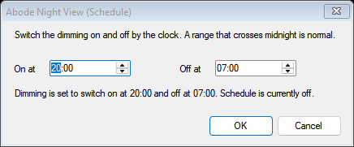
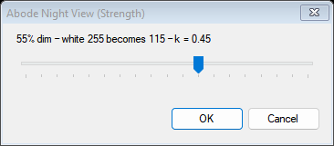
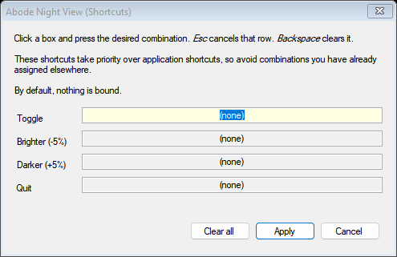
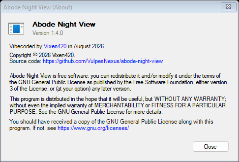

# Abode Night View

A display-only dimmer for Adobe document viewports.

At 2am a page of white paper at full brightness is a lamp pointed at your face.
Abode Night View parks a black, click-through, layered window over each Adobe
document canvas and lets the Windows compositor multiply it down. The page goes
from 255 to about 115; the panels, the menus, the toolbar and everything else on
your desktop are untouched.

**It never modifies a document.** It reads window geometry and paints its own
windows. It does not open, script, message, hook or inject into any Adobe
application, and nothing it does can reach a saved file or an export.

    AbodeNightView.exe          start it; a moon appears in the tray
    tray → Enabled              on / off
    tray → Schedule             on and off by the clock, on a range you set

One file, 378 KB, no installer, no admin rights, no runtime to download.
Free software under the [GNU GPL v3 or later](#licence).

**No keyboard shortcut is bound out of the box**, on purpose — a global hotkey
is taken from every program on the machine, not just from Adobe, and no
combination is free of AltGr, free inside Adobe and present on every keyboard at
once. Set your own in tray → Shortcuts; the editor tells you what each one would
cost you on *your* keyboard. See [Shortcuts](#shortcuts).

---

## Contents

- [What gets dimmed](#what-gets-dimmed)
- [Compatibility](#compatibility)
- [The tray menu](#the-tray-menu)
- [The schedule](#the-schedule)
- [Shortcuts](#shortcuts)
- [Command line](#command-line)
- [Settings](#settings)
- [Diagnostics, and what to send with a bug report](#diagnostics-and-what-to-send-with-a-bug-report)
- [Colour-critical work](#colour-critical-work)
- [How it works](#how-it-works)
- [Rendering](#rendering)
- [Architecture](#architecture)
- [Known limitations](#known-limitations)
- [Verifying it yourself](#verifying-it-yourself)
- [Performance](#performance)
- [Building](#building)
- [Distributing it](#distributing-it)
- [Safety check](#safety-check)
- [Still worth doing by hand](#still-worth-doing-by-hand)
- [Licence](#licence)
- [Files](#files)

---

## What it looks like

<p align="center">
  
  
</p>
<p align="center">
  
  
</p>

The tray menu is drawn by Windows into a menu that only exists while a pointer
is held still, so it is written out below rather than photographed. Everything
else here is the window itself, rendered by the same code that shows it to you.

---

## What gets dimmed

One overlay per **visible document viewport** — not per application. Two
documents tiled side by side get two overlays; four applications get four; an
application with no document open gets none.

| product | what the overlay covers by default | rulers dimmed | on by default |
|---|---|---|---|
| InDesign | the canvas, inside the rulers and scrollbars | no | yes |
| Illustrator | the canvas: artboards *and* pasteboard | yes, if shown | yes |
| InCopy | the whole document viewport | yes, if shown | yes |
| Photoshop | the whole document viewport, image and pasteboard | yes, if shown | **no** |
| Acrobat | the page area, inside the scrollbar | n/a | yes |

You can change the region per product (tray → Region): **Canvas only**,
**Document viewport** (adds rulers and scrollbars), **Application client area**,
or **Whole window**.

### Rulers

InDesign's rulers are **not dimmed**. Illustrator's and Photoshop's **are**, if
you have them switched on. That is not a policy; it is a difference in how the
two lay their windows out, and it decides the matter on its own.

InDesign's canvas is a real child window that is inset from the document
container by exactly the strips Adobe paints the rulers and scrollbars into:

    OWL.Document        43,132  2094x1259
      canvas child      59,148  2063x1227      <- inset 16 left, 16 top
                                                  (rulers), 15 right, 16 bottom
                                                  (scrollbars)

Dimming the canvas therefore leaves them alone for free, measured at ratio
**1.000** on all four strips. It also follows View → Show/Hide Rulers with no
code involved: hide them and the same child window grows to `43,132 2079x1243`,
reclaiming the strip, and the overlay follows on the next tick.

Illustrator and Photoshop put their canvas child at the *same origin* as the
document container — `42,100 1893x1250` inside `42,100 1909x1291` — and paint
the rulers inside it. There is no ruler window to measure and nothing in the
geometry that distinguishes a ruler from the artwork under it. Measured on
Illustrator at strength 35: the rulers dim to **0.657**, the canvas to 0.646.

Excluding them would mean a hard-coded strip thickness. That fails for the same
reason a hard-coded anything fails here: Adobe scales the ruler with its own **UI
Scaling** preference, which is independent of the Windows DPI, so a constant that
is right on this machine is wrong on the next one — and being wrong means either
an undimmed band inside the canvas or a dimmed band across the artwork. Left as a
known cosmetic limitation rather than guessed at.

The `--verify` run asserts this: every strip the canvas rectangle excludes is
photographed with the overlay off and on and must not have been multiplied by k.
Full numbers in [`measurements/rulers.md`](measurements/rulers.md).

### Illustrator — what you are actually seeing

The overlay covers the whole document viewport, so it dims the artboards, the
pasteboard *and the artwork on them*. It does not replace white artboards with
dark ones and it is not a UI theme: it is an optical filter over everything in
that rectangle. In practice that is what you want — the glare is the artboard —
but artwork inside the artboard is dimmed by exactly the same factor.

### Photoshop — off by default, on purpose

Photoshop works exactly as well as Illustrator does; it was measured doing so.
The reason it starts switched off is not technical, it is semantic. An InDesign
or Illustrator viewport is mostly white paper you are placing content *onto*;
dimming it removes glare. A Photoshop viewport is mostly **the image**, and
dimming it changes the apparent brightness of the thing you are editing.

Whole-canvas dimming is a perfectly reasonable thing to want at 2am — it is just
not a safe default, and the tool should not imply it is only dimming "the paper"
when there is no paper. Tick Photoshop in tray → Targets if you want it.

The tray menu lists it by name like every other product. The reasoning is here
and in `--probe`, which prints it next to the default; a menu item is a place
for a name and a state, not for an argument with the person reading it.

---

## Compatibility

Four evidence levels, used strictly:

- **Tested** — run here, measured, numbers recorded in this repository.
- **Structurally expected** — the code path is version-independent and the
  structure it needs is documented, but this exact version has not been run.
- **Experimental** — implemented but not trusted.
- **Unsupported** — will not attach.

### Adobe products

Every ratio below is `canvas luminance with the overlay on ÷ canvas luminance
with it off`, at strength 55, where the alpha implies **k = 0.451**. All five
were measured in one session against `dist\AbodeNightView.exe` 1.2.0, with all
five overlays live at the same time.

| product | version tested | status | evidence |
|---|---|---|---|
| InDesign | 2026 (21.5.1) | Supported | **Tested** — verify 13/13, canvas 183.71 → 82.87, ratio **0.451** |
| Illustrator | 2026 (30.7.0) | Supported | **Tested** — verify 13/13, canvas 118.14 → 53.06, ratio **0.449** |
| InCopy | 2026 (21.5.1) | Supported | **Tested** — verify 12/12, canvas 147.15 → 66.13, ratio **0.449**. Promoted from "structurally expected" only after a document was open and the viewport actually validated |
| Photoshop | 2026 (27.9) | Supported, **off by default** | **Tested** — verify 13/13, canvas 141.02 → 63.53, ratio **0.450**. See [Photoshop](#photoshop--off-by-default-on-purpose) for why the default is off |
| Acrobat | 26.1.21771.0 | Supported | **Tested** — verify 14/14, canvas 207.02 → 93.98, ratio **0.454** |
| InDesign / Illustrator / Photoshop / InCopy / Acrobat, other years | — | Expected | **Structurally expected** — there is no version whitelist; see [Future Adobe versions](#future-adobe-versions). Partly demonstrated: Illustrator **28.7.10** (2024, two majors older than the version above) resolved its viewport unchanged and the overlay landed exactly on the canvas rectangle — 7 structural checks, 0 failures. The photometric half was not taken, because Adobe's own “an older version is installed” dialog was sitting over the canvas and the verifier refuses to measure through an obstruction |
| After Effects, Premiere Pro, Media Encoder | — | Unsupported | Deliberate. The viewport is video, usually dark, and colour-critical. Dimming it is the wrong tool |
| Audition | — | Unsupported | No page-like viewport |
| Bridge | — | Unsupported | A thumbnail grid on a dark ground; nothing white to dim |
| Lightroom Classic, Animate, Dreamweaver, XD | — | Not investigated | Not installed on the machine this was built on. Saying anything about them would be guessing |

"Supported" here means *tested and measured*, not "I see no reason it wouldn't
work". The two are kept apart everywhere in this document.

### Displays

| configuration | status |
|---|---|
| 1920×1080, 2560×1440, 1440×2560 portrait, 1280×720 | **Tested** — 17/17 rectangles exact |
| three monitors, negative desktop coordinates, monitor-edge straddling | **Tested** |
| 100 % scaling | **Tested** — every measurement in this document |
| **125 % scaling** | **Tested by hand** — run by the user on their own machine; no visible defects. This is a human looking at the screen, not an automated measurement, and it is recorded as such |
| other scaling factors, mixed-DPI setups, 4K, HDR, Remote Desktop | Not tested. The code holds no logical-pixel constants; see [Known limitations](#known-limitations) |

### Operating systems

| platform | status | backend |
|---|---|---|
| Windows 11 (26200) | **Tested** | Win32 + DWM layered composition |
| Windows 11, other builds | Structurally expected | same |
| Windows 10 22H2 (19045) / 21H2 (19044) | Structurally expected | same |
| Windows 10 before 2004 (19041) | Degraded | everything works except screen-capture exclusion, which is version-gated and reported |
| Windows 8.1 and older | Unsupported | not claimed, not tested; Adobe does not support its 2026 applications there either |
| macOS | **Shelved** | Research only. No implementation, no build, no support claim, until there is Apple hardware to test on — see [MACOS.md](MACOS.md) |

**The Windows floor is Windows 10 version 21H2 (build 19044)**, chosen because
that is the oldest Windows on which Adobe supports the applications this
attaches to. Every API used is present from there on, including
`WDA_EXCLUDEFROMCAPTURE` (needs 19041). The DPI, monitor and cloaking APIs are
all reached through a fallback cascade, so an older Windows degrades rather than
crashes — but that is a property of the code, not a tested claim.

### Future Adobe versions

There is no version table anywhere in the source. A product is recognised by
**process name plus frame window class**, and then the structure is *validated*:

    Illustrator.exe running
      -> a top-level window of class 'illustrator'
      -> ... > OWL.TabGroup > OWL.Document > inner view container
      -> attach

An Adobe release from a year that did not exist when this was built attaches
normally if it still looks like that, and appears in the tray menu under its own
name — which is read from the executable's `ProductName` resource, so it says
"Adobe Illustrator 2028" without anybody having typed that.

If the structure has changed, nothing is dimmed and `--probe` says exactly which
step failed and what it found instead. That is the difference between a version
whitelist and capability detection: the failure is diagnosable without a rebuild.

---

## The tray menu

```
Abode Night View 1.3.0            <- click for About
──────────────────────────
✓ Enabled                          <- reads "Disabled", unticked, when off
✓ Schedule (20:00 – 07:00)  >      <- reads "(off)" when there is no schedule
      Off
    ✓ On from 20:00 to 07:00
      ──────────
      Set range...
──────────────────────────
Targets (4 selected, 3 running)  >
      ✓ Acrobat
      ✓ Illustrator 2026
      ✓ InDesign 2026
        Photoshop 2026 (no document open)
      ──────────
      Not running: InCopy

Region  >
      InDesign 2026  >   ✓ Canvas only / Document viewport / ...

Strength (55%)  >   ... ✓ 55% (k = 0.45) ...  Custom...
──────────────────────────
✓ Include in screen captures
──────────────────────────
Shortcuts...
Re-scan for Adobe applications
Diagnostics...
Probe Adobe applications...
──────────────────────────
Exit
```

**Targets is alphabetical and drops the word "Adobe".** Every product this
utility knows about is an Adobe one, so the word sorted nothing and told the
reader nothing. The name that is left is still read from the running
executable's own `ProductName` resource, so a year nobody here has seen still
appears correctly.

**"Not running" appears only when something compatible IS running.** With
nothing open, the menu said "No supported Adobe application is running" and then
listed all five of them immediately underneath — a contrast with nothing to
contrast against. Note that *compatible* is doing the work: Premiere Pro is not
one of the five adapters, so no amount of it running brings the list back.

**A version this build cannot hook into says so, by name:**

```
Targets (4 selected, 2 running)  >
      ✓ Illustrator 2026
        InDesign 2027 (unsupported version)
      ──────────
      That version's windows are not ones this build can read.
      Run "Probe Adobe applications..." and send the report.
```

There are four distinct answers to "why is nothing dimmed", and they used to be
one silence: not running, running and unreadable, running with no document open,
and attached. The middle two are told apart structurally rather than guessed at
— an application whose own window framework is present but has no document view
in it has no document open; one with no recognisable framework at all is a
version whose windows have been rearranged. A splash screen is filtered out by
shape, so a slow launch is never reported as an unsupported version.

**A product you have unticked reports the same state as one you have ticked.**
The engine only tracks windows for the products that are switched on, so the
menu is asked about the others with nothing in hand — and an unticked Photoshop
sitting on its welcome screen was answering "unsupported version", which is a bug
report about a version that is perfectly fine. The unticked ones are now looked
up and inspected like the rest, and `Audit.exe --selftest` asserts that the
answer does not depend on whether the product was being tracked, nor differ from
what `--probe` says about the same window.

**Whatever there is to say about a product goes in one parenthesis after its
name** — `Photoshop 2026 (no document open)`, `InDesign 2027 (unsupported
version)`, `Illustrator 2026 (2 windows, no document open)`. It used to be a
padded dash, and a dash needs a gap on each side to read as a separator at all,
which is where the run of spaces in the menu came from. The same rule gives
`Schedule (off)` and `Strength (55%)`, and the text comes from `TrayState` —
pure functions — so `Audit.exe --selftest` can read every line the user reads
and assert there is no gap inside any of them. There is one further trap in
there: Photoshop's own `ProductName` resource ends in a space, so a label built
by concatenation had a hole in it wherever that name went. It is squeezed once,
where the version resource is read.

**A product is called the same thing everywhere.** The engine only tracks
windows for the products that are switched on, so anything unticked had no frame
to take a name from — and the same Photoshop was `Photoshop 2026` in the tray
menu and `Photoshop` in the notification, a few seconds apart, with nothing to
tell a reader which was right. Both now enumerate.

**The global state is given twice**: the item's *word* changes between `Enabled`
and `Disabled`, and the enabled state also carries a checkmark. One or the other
alone was ambiguous — a lone "Enabled" reads equally as a label and as a button.

The Strength window states the same number three ways — `20% dim | 255 (pure
white) displays as 204 | k = 0.80` — because the percentage is the setting, 204
is what you will actually see, and k is what the compositor multiplies by. The
middle reading names its input as well as its output: `255 (pure white) displays
as 204` says which way the arithmetic runs, where an earlier `white 255 becomes
204` left that to be inferred.

Hover text is exactly:

    Abode Night View: [ON] | 55%
    Abode Night View: [OFF] | 55%

with the reason appended when it is switched on and nothing is being dimmed,
because "on but doing nothing" is otherwise indistinguishable from broken:

| what is true                                     | hover says            |
| ------------------------------------------------ | --------------------- |
| nothing selected is running                       | `no target`           |
| running, and showing no document                  | `no document open`    |
| running, and this build cannot read its windows   | `unsupported version` |
| running and readable, but minimised or off-screen | `nothing to dim`      |

Those are the Targets menu's own words, and they are not a second opinion: the
hover and the menu are two renderings of one survey of the desktop. They used to
be two ideas of what a target *is* — the menu asked the desktop, the hover
counted overlays and called zero of them "no target" — so a Photoshop sitting on
its welcome screen was `Photoshop 2026 (no document open)` in the menu and
`no target` on hover, at the same moment, about the same program. An application
that is running and selected **is** a target; whether it is currently offering
anything to dim is a different question, and the hover now answers that one.

The hover is also rebuilt when the number of overlays or the number of frames
changes, not only when you click something. Before, opening a document left the
tooltip reading `no target` until the next time you touched the menu.

The notification is one line of the same state:

    [ON] 55% (k = 0.45)

Neither names the filter any more. Neutral is the only mode this build renders,
so the word was identical in every possible state — a third of a 63-character
tooltip budget spent saying nothing. Dropping it is also what made room to write
the product's name out in full instead of as "Abode NV".

**The notification carries the artwork for the state it is announcing** — the
plain icon when the dimming is off, the same character in sunglasses when it is
on — so the state is readable before the sentence under it has been. Windows
Forms only offers four stock pictures for a balloon, but the shell has taken an
arbitrary one since Windows XP SP2 (`NIIF_USER` with `hBalloonIcon`), so the
notification is raised through `Shell_NotifyIcon` directly. Doing that needs the
window handle and id of an icon already in the notification area, and those are
private fields of `NotifyIcon`, read by reflection. Every step of that can fail
— a future runtime renaming a field, a missing resource, the shell refusing the
call — and every step falls back to the ordinary balloon with a stock icon
rather than to an exception. `--diagnostics` prints which path was taken, because
a silent fallback that looks right on the machine it was written on is the exact
failure this project keeps guarding against.

The notification appears at launch, and whenever the switch is thrown **by hand**
— the tray item, a double-click on the icon, or a shortcut. The clock does not
raise one: a scheduled change at 03:00 is not worth waking anybody for.

**Every checkmark is computed when the menu opens**, from the live state.
Nothing stores a tick. The tooltip and the menu are produced by the same two
functions from the same values, so they cannot disagree — asserted mechanically
in `Audit.exe --selftest`.

The top line opens **About**: the version read out of the binary's own version
resource, who wrote it, a link to the repository, and the GNU GPL notice with
the licence linked. The icon there is *painted* rather than converted, because
`Icon.ToBitmap()` cannot read a PNG-compressed `.ico` entry — it walks the
payload as though it were a device-independent bitmap and returns noise, which
is exactly what the About box showed for two releases. `Graphics.DrawIcon` goes
through `DrawIconEx`, the same path the shell uses, and `build-release.ps1`
now refuses to ship a source tree that calls `ToBitmap` at all.

There is **no Mode submenu**. This build renders one filter, and a submenu with a
single possible choice is a control that cannot be used for anything. The filter
is named in `--diagnostics`, where "which one did this build actually render?" is
a real question. See [Rendering](#rendering) for what was removed and what it
measured.

---

## The schedule

A page of white paper at 2am is a lamp, and "2am" is a fact the machine already
knows. Tray → Schedule switches the dimming on and off by the clock, on a range
you set:

```
tray → Schedule → Set range...      On at [20:00]   Off at [07:00]
AbodeNightView.exe --schedule=20:00-07:00
AbodeNightView.exe --schedule=off
```

**It is off until you ask for it.** Putting a filter over somebody's artwork
unasked is the one thing a display-only tool must not do, so nothing switches
itself on until you have said so once.

**The range wraps.** 20:00 to 07:00 crosses midnight, which is the normal case
rather than the awkward one. The start minute is included and the end minute is
excluded, so nothing belongs to both ends.

**A manual override stands.** The schedule is *edge* triggered: it acts when the
answer to "should this be on now?" changes, not continuously. Switch it off by
hand at 01:00 and it stays off until 07:00 — a schedule that re-asserted itself
every quarter second would make the tray item look broken for half the night.

**The clock can move.** Daylight saving, a manual correction, a laptop waking up
and resynchronising with a time server: each of those is a boundary that has
silently gone past. `SystemEvents.TimeChanged` re-evaluates rather than waiting
for the next one.

**What it is about to do is on the item, not under it.** The Schedule item
reads `Schedule  (20:00 – 07:00)` or `Schedule  (off)` before the pointer ever
reaches the drop-down, so the submenu carries the two choices and the range
editor and nothing else. The editor's own sentence is the longer form:

    Dimming is set to switch on at 20:00 and off at 07:00.  On now, until 07:00 tomorrow.

The first half describes the range being edited and the second describes what
the schedule is doing about it — which, with the schedule switched off, is
`Schedule is currently off.` Those are two separate statements because a range
can be set up for later use while the schedule is not running, and a countdown
to a change that is not going to happen is worse than no sentence at all.

---

## Shortcuts

**Nothing is bound out of the box.** `RegisterHotKey` installs a system-wide
keyboard grab: the shell dispatches the keystroke to Abode Night View *before*
offering it to whatever has focus, so a default binding is not a convenience, it
is a key taken away from every program on the machine on the user's behalf.

Every candidate for a default was ruled out, each for a different reason:

| candidate | why not |
|---|---|
| `Ctrl+Alt+<printable>` | AltGr reports itself to Windows as Ctrl+Alt. On German, French, Polish, Portuguese, Nordic, Spanish, Czech, Turkish and US-International layouts this **is** the AltGr character on that key, and taking it stops that character being typable anywhere. This is what 1.2 and earlier shipped. |
| `Win+<anything>` | Windows 10 and 11 reserve the Windows key; the combinations are consumed by the shell and are not reliably registrable. |
| `Ctrl+Shift+…` / `Alt+Shift+…` | Windows' own defaults for switching keyboard layout and input language live on those modifier pairs, and `Ctrl+Shift+<letter>` is heavily used inside every Adobe application. |
| `F1`–`F12`, any modifier | Adobe assigns panels and commands across the whole function row in InDesign, Illustrator and Photoshop, and users remap them freely. A global grab takes the key from every application, not only from Adobe. |
| Numpad, Pause, Scroll Lock | Layout-proof, and absent from most laptop and tenkeyless keyboards, or behind `Fn`. |

Nothing satisfies *free on every layout* **and** *free in Adobe* **and** *present
on every keyboard*, so nothing is bound. The tray menu and the schedule work
without a shortcut. Set your own in tray → Shortcuts; *Esc* cancels a row and
*Backspace* clears it — both of which the dialog says, with the key names in
italics, because "Esc cancels that row" otherwise reads as a sentence about
escaping. Nothing pre-announces that a combination might be refused; Apply
reports the ones Windows actually refuses, at the moment it refuses them.

**The AltGr warning did not become unnecessary when the defaults went away — it
became more necessary.** A custom binding is captured from the user's own
keyboard, which sounds like it should settle the question, and does the opposite:
on a German layout, pressing `AltGr+Q` to type `@` arrives at the editor as
`Ctrl+Alt+Q` and would be accepted as a perfectly ordinary-looking shortcut. The
user would have bound the key they type `@` with and would not find out until the
next time they needed one. So the editor asks the **live keyboard layout**
(`ToUnicodeEx`) what `AltGr+<key>` actually types and quotes the character back:

    Ctrl+Alt+Q is AltGr+Q on this keyboard, which types "@". Taking it stops
    that being typable in any program while Abode Night View runs.

A combination that is free on *this* keyboard and is AltGr somewhere else still
gets the older, general warning — a copy passed to someone on another layout is
the case the first check cannot see.

**Upgrading from 1.2 removes the four old defaults.** `Ctrl+Alt+N`,
`Ctrl+Alt+Up`, `Ctrl+Alt+Down` and `Ctrl+Alt+Q` are deleted from an existing
settings file **only where they are still exactly what 1.2 wrote** — those were
never a choice. A combination you set yourself is left alone, including
`Ctrl+Alt+N` if you deliberately bind it back. The notification at launch says
how many were withdrawn, so a key that stops working is never a silent change.

---

## Command line

```
AbodeNightView.exe                     start, using AbodeNightView.ini
AbodeNightView.exe --on                start switched on regardless of settings
AbodeNightView.exe --off
AbodeNightView.exe --schedule=20:00-07:00    switch on and off by the clock
AbodeNightView.exe --schedule=off      no schedule; switch it by hand
AbodeNightView.exe --strength=55       dim to 55% (k = 0.45)
AbodeNightView.exe --region=canvas     canvas | document | client | window, all products
AbodeNightView.exe --region.photoshop=document
AbodeNightView.exe --products=indesign,illustrator      only these, this run
AbodeNightView.exe --zmode=above       chase the z-order instead of owning the window
AbodeNightView.exe --capture=exclude   keep the overlays out of screenshots (Win10 2004+)
AbodeNightView.exe --pid=1234          track one process only

Diagnostics:
AbodeNightView.exe --version           one line: version | arch | CLR | Windows
AbodeNightView.exe --diagnostics       write and open AbodeNightView-diagnostics.txt
AbodeNightView.exe --probe             why did this Adobe version not attach?
AbodeNightView.exe --probe=photoshop
AbodeNightView.exe --verify            photometric and structural self-test
AbodeNightView.exe --baseline          capture the reference, switched OFF
AbodeNightView.exe --watch=25          log every overlay transition for 25 seconds
```

Product ids: `indesign`, `illustrator`, `incopy`, `photoshop`, `acrobat`.

`--version` is one line of pure ASCII, on purpose. It is the line that gets
pasted into a bug report, and it comes back through whatever codepage the
reporter's console happens to be set to:

    Abode Night View 1.3.0 | x64 | .NET Framework 4.0.30319.42000 | Windows 10.0.26200

**Output from the diagnostic subcommands can look empty from PowerShell.** This
is a GUI-subsystem binary, so double-clicking it never flashes a console — and
the cost of that is that a shell does not *wait* for it. Pipe or redirect and
the shell waits:

```powershell
.\AbodeNightView.exe --probe 2>&1 | Out-String -Width 200
Start-Process .\AbodeNightView.exe --version -NoNewWindow -Wait -RedirectStandardOutput out.txt
```

---

## Settings

`AbodeNightView.ini`, next to the executable. If that folder is not writable —
Program Files, a network share, a read-only download — it falls back to
`%APPDATA%\AbodeNightView\` rather than silently losing every change.

```ini
schema=3
enabled=1
strength=55
mode=neutral
captures=1
zmode=owned

schedule=0
schedule.from=20:00
schedule.to=07:00

target.indesign=1
target.illustrator=1
target.incopy=1
target.photoshop=0
target.acrobat=1

region.indesign=canvas
region.photoshop=document

hotkey.toggle=
hotkey.brighter=
hotkey.darker=
hotkey.quit=
```

An empty `hotkey.` value means nothing is bound, which is what ships. See
[Shortcuts](#shortcuts) for why, and for what an upgrade from 1.2 does to the
four values that used to be there.

Everything you change through the tray is written here immediately and is the
default next time: enabled state, strength, mode, the schedule, per-product
on/off, per-product region, and the shortcuts.

**Coming from Night View 1.0?** A `NightView.ini` next to the executable (or in
`%APPDATA%\NightView\`) is imported automatically on first run. One key changed
meaning — `target=` named a *region* back when InDesign was the only product, so
it becomes `region.indesign=`. Everything else keeps its name and its value. The
old file is left where it is, so downgrading still works.

Unknown keys are preserved, not discarded: a settings file written by a newer
version survives a round trip through an older one. Invalid values are clamped or
rejected — an out-of-range strength used to go straight to the alpha and could
produce an opaque black rectangle over the canvas.

`mode=` is normalized on load. A file naming a mode this build cannot render —
1.1's `greyscale` or `shader`, a hand-edited value, a mode from some later
release — starts on `neutral` and is written back as `neutral` on the next save,
silently. There is no error, because there is nothing the user needs to do: the
only way either of those could be in a file is by typing it in, since neither was
ever selectable.

---

## Diagnostics, and what to send with a bug report

    AbodeNightView.exe --diagnostics

writes `AbodeNightView-diagnostics.txt`: Windows build, DPI awareness actually
applied, which optional APIs this machine has, every monitor with its rectangle
and scaling, every recognised Adobe application with its version and resolved
viewports, the live overlay slots, and the settings as loaded. No document
names, no file contents, no window titles other than the application frames.

    AbodeNightView.exe --probe

is the one to run when something *should* be dimmed and is not. Per product it
prints the process names and frame class it looks for, the structure it requires,
what it found, and — on failure — a short list of the visible window classes it
saw instead:

```
== Adobe InCopy  (id incopy)
   expected structure   frame class 'incopy' > ... > OWL.TabGroup > OWL.Document > inner view container
   product name         Adobe InCopy 2026
   product version      21.5.1
   viewports found      0
   VALIDATION           FAILED - the expected relationship was not found.
                        Most likely: no document is open. Open one and re-run.
                          visible descendant classes, largest first:
                            OWL.Dock                    x4    largest 42,71 2518x1285
                            ...
```

---

## Colour-critical work

**Disable Abode Night View for colour-critical visual judgement.**

It changes nothing in your document and nothing in an export. It does change what
you see: a neutral multiply of every pixel inside the viewport. Tone, contrast
and apparent saturation are all affected. Switch it off — tray → Enabled, or a
shortcut of your own — before you judge a colour, a proof, or a black point.

It is a comfort filter, not a colour-management tool, and it does not pretend to
be one.

---

## How it works

The overlay is a black window with `WS_EX_LAYERED` and
`SetLayeredWindowAttributes(alpha)`. DWM composites it source-over:

    out = src·α + dst·(1−α)
        = 0·α   + dst·(1−α)
        = dst · k                 where k = 1 − α

A black source turns alpha blending into an exact per-channel multiply, computed
by the compositor, with no screen capture, no duplicated rendering and no added
latency. 55 % strength is k = 0.45.

**Measured, not assumed.** `Transfer.exe` recovers the per-level curve from a
before/after capture of a six-step wedge:

```
   in    out     in·k    linear-blend
     0    0.0      0.0            0.0
    32   14.0     14.5           19.0
    64   29.0     28.9           42.0
   128   58.0     57.8           88.0
   192   87.0     86.7          133.9
   255  115.0    115.2          179.2

  best-fit k = 0.4517
  mean |error| vs  out = in·k      : 0.22 levels
  mean |error| vs  blend in linear : 26.32 levels
```

DWM composites layered windows in **sRGB-encoded values** — a plain 8-bit
multiply. No gamma correction belongs anywhere in the path. This was measured
twice on unrelated targets: 7,593,903 pixel pairs over InDesign's
GPU-composited canvas (k = 0.4510, 0.21 levels from a pure multiply) and
2,845,152 over a plain GDI window with no Direct3D anywhere (k = 0.4517, 0.22
levels). The two agreeing is what establishes that **the dimming does not depend
on the target's renderer** — it is identical over a window Adobe did not draw.

### The limitation this leaves

Alpha blending gives you `out = k·dst + c·α` and nothing else. One shared `k`,
no per-channel gain, no channel mixing, no curve. So white lands at 115 rather
than the 130 a compressed-highlight curve would give, and the midtones sit lower
than ideal:

| in | Neutral gives | a tone curve would give |
|---|---|---|
| 0 | 0 | 0 |
| 32 | 14 | 28 |
| 128 | 58 | 85 |
| 255 | 115 | 130 |

That is a real cost, honestly paid for zero latency. See [Rendering](#rendering).

---

## Rendering

There is one filter. It is called **Neutral** and it is the only thing the
program can do to a pixel:

    out = src·a + dst·(1-a)      DWM source-over, in sRGB-encoded values
    src = black                  so out = dst·k,  k = 1-a

A per-channel multiply by a single constant. Hue, saturation and relative
contrast are all preserved; only the level moves. No capture, no second render
path, no frame of latency — DWM composites the overlay with the target window in
the same frame it was already going to draw.

### Rejected rendering approaches

Three other modes existed in the source at one point. All three are gone from
1.2.0, and each was removed on a measurement rather than an opinion. This is a
design decision, not a to-do list: none of them is "coming soon".

| mode | why it is not shipped |
|---|---|
| **Warm** | Removed in 1.2.0. It was cheap, deterministic and did the wrong thing — see below |
| **Greyscale** | The only route that does not capture the screen did not perform the channel mixing it was asked for, and needs an unsynchronised refresh timer |
| **Shader** | A correct tone curve needs capture plus GPU processing, and therefore a frame of latency by construction |

#### Why Warm was removed

Warm set the overlay to an amber source colour instead of black. Measured against
Illustrator's canvas at strength 35 with the default tint, the whole transform is
visible in three numbers — the canvas read 96/96/96 undimmed and **83/70/62**
with Warm on, against a prediction of 83.4/70.8/62.4. So it is exactly what the
arithmetic says it is: precise, deterministic, and composition-native.

The problem is what the arithmetic says. With a non-black source, source-over
becomes *multiply by k, then add light*:

    out_R = k·R + (1-k)·60      out_G = k·G + (1-k)·24      out_B = k·B + 0

Three consequences, all measured:

- **It removes no blue.** `out_B` is `k·B` — identical to Neutral. A warm filter
  is supposed to attenuate blue relative to red; this cannot, because a layered
  window applies one alpha to all three channels and an offset can only *add*.
  The name describes an effect the mechanism cannot produce.
- **It emits more light than Neutral, not less.** Same canvas, same strength:
  Neutral gave luminance ratio 0.65, Warm gave **0.75**.
- **It lifts the black floor.** Break-even for red is at level 60: every pixel
  darker than that comes out *brighter* than it started. The measured ruler strip
  went 59.6 → 60.1 in red. Black artwork and Adobe's own dark interface turn a
  dull red, which on a layout tool is a colour-fidelity problem rather than a
  matter of taste.

It was kept for a while behind the label "Warm (approximate)". "Approximate"
turned out to mean "does not do the thing it is named after", which is not a
caveat, it is a different feature. Removed.

#### Why Greyscale is not shipped

The one Windows primitive that could produce grayscale *without* capturing and
redrawing the viewport is the Magnification API's `MagSetColorEffect`, a
documented 5×5 colour matrix applied by a `WC_MAGNIFIER` control at 1.0×.
Prototype C implements exactly that. Measured on this machine:

- **1.0× magnification does not resample.** An identity matrix produced a copy
  that was byte-for-byte identical to the source over 400,000 pixels. Text stays
  sharp. This was an open question and it is now settled.
- **The diagonal and the additive row are honoured exactly.** Three different
  per-channel gains came back within 0.4 % of what was asked, and an inversion
  matrix inverted correctly.
- **Channel mixing did not happen.** A pure Rec.709 grayscale matrix behaved as a
  *neutral* gain of k, with saturation fully preserved and simply scaled by k.
  Every result was consistent with the implementation collapsing each colour
  column to its sum and applying it as a per-channel gain.

So the primitive does not do the one thing Greyscale needs. That is a measured
reason to leave the mode disabled, not a guess. Scope of the claim: one machine,
one GPU, one Windows build — enough to refuse to ship it, not enough to say the
API can never do it.

There is a second, independent reason. Even where it works, the magnifier is a
**capture-and-redraw** path: there is no "the source repainted" notification, so
the copy is refreshed on a timer, measured at 36–38 refreshes/s against a 16 ms
timer, unsynchronised with the window underneath. Neutral has no such term — DWM
composites the overlay with the target in the same frame. A filter that trails
the canvas while you scroll is worse than a mathematically imperfect one that
does not.

#### Why Shader is not shipped

The highlight-compression curve is not affine, and neither alpha blending nor a
colour matrix can express it. The options that can:

| approach | why not |
|---|---|
| `SetDeviceGammaRamp` / DXGI gamma control | genuinely non-affine, but applies to the **whole output**. It would dim the panels, the menus and the other monitor's contents too. Fails the one requirement the product exists for |
| Windows Graphics Capture + D3D11 pixel shader + DirectComposition | can do arbitrary curves. Also: capture permission surface, recursion risk, a GPU dependency, hand-written WinRT interop from .NET Framework, and one frame of latency by construction. That is a different program, not a mode |

Deferred, documented, and the affine limitation is documented as a property of
Neutral instead of hidden behind a mode that does not exist.

The research code is kept, out of the product tree, in
[`experiments/ProtoC_MagnifierOverlay.cs`](experiments/ProtoC_MagnifierOverlay.cs)
— an answer is only worth as much as the thing that produced it.

---

## Architecture

```
                 discovery: one EnumWindows pass
                            |
        +-------------------+-------------------+
        |                   |                   |
   InDesignTarget    IllustratorTarget    AcrobatTarget      <- adapters
        |                   |                   |
        +-------------------+-------------------+
                            |
                   validated viewports
                            |
                    overlay controller
                            |
        +-----------+-------+-------+-----------+
     overlay     overlay        overlay      overlay         <- one per viewport
```

**Product-specific knowledge lives only in the adapters.** Each one knows its
process names, its frame window class, and the *structural relationship* its
viewport sits in — and validates that relationship before it will return a
rectangle. The overlay engine below them knows nothing about Adobe.

The four OWL products share one adapter class parameterised by name, because
they measurably share one hierarchy:

```
<frame class>                indesign | illustrator | incopy | Photoshop
  OWL.Dock
    OWL.TabPane
      OWL.TabGroup
        OWL.Document         <- the document viewport
          <inner container>  <- the canvas, strictly inside it
```

| product | OWL.Document | inner container | inner/outer |
|---|---|---|---|
| InDesign | 43,132 2094×1259 | 59,148 2063×1227 | 96 % |
| Illustrator | 42,100 1909×1291 | 42,100 1893×1250 | 94 % |
| Photoshop | 663,1532 1470×939 | 663,1532 1454×923 | 97 % |

The inner container's *class* is not shared — InDesign and Illustrator use
`DroverLord - Window Class`, Photoshop uses `Static` — so the canvas is found by
the geometric relationship (largest visible descendant strictly inside
`OWL.Document`, at least half its area). That was already the verified InDesign
rule; it now lives in one place and every product uses the same code.

Acrobat is a different framework and gets its own adapter:
`AcrobatSDIWindow` → an `AVL_AVView` whose **window text** is `AVPageView`.
Acrobat names its views in the title rather than the class, which is a far
stronger key than a class shared by 23 windows in the same process.

**What this deliberately is not:** a "largest child window" heuristic applied to
every Adobe application. That is the exact mistake the first audit removed — it
picked up transient windows during editing and dragged the overlay onto the wrong
rectangle. Generalising meant *one lifecycle and one overlay engine plus small
validated adapters*, not one clever guess.

### Z-order

Each overlay is made an **owned window** of its application frame
(`SetWindowLongPtr(GWLP_HWNDPARENT)`). Windows then keeps an owned window above
its owner and raises the pair together, so activating the application cannot
produce even the one-frame gap that chasing the z-order leaves behind. Ownership
is not parenting: it does not attach input queues.

The link is also **given back**. It is the only state this program leaves inside
another process's window tree, so it is dropped the moment an overlay stops being
attached — when the document goes away, and before the window is destroyed at
exit. Two reasons, neither cosmetic: Windows
destroys a window's owned windows along with the owner, so a pooled spare left
owned is a window volunteered for destruction the next time the application
quits; and the check that decides whether to re-own asks the window
(`GetWindow(GW_OWNER)`) rather than a cached handle, because window handles are
recycled and a stale one can match a brand-new frame. `Audit.exe` asserts both
halves — that detaching returns the owner to `NULL`, and that reacquiring takes
it back rather than silently degrading to `zmode=above`.

Ownership is necessary but **not sufficient**, and the invariant is re-checked
every sync. Three separate faults are corrected:

1. **Not above the owner at all.** "An owned window is above its owner" is
   enforced when the owner is *activated*, not when it is re-ordered some other
   way. Showing another owned window raises the owner without taking the overlay
   with it, and the dimming then silently stops. Regression-tested: reproduced
   deterministically, recovery measured at 59-185 ms single-target and 135-250 ms
   with several targets tracked, over four consecutive runs.
2. **A foreign window sandwiched between overlay and owner.** With two maximised
   Adobe applications on one monitor, InDesign's overlay can be left above
   Illustrator's frame — legitimately above *its own* owner the whole time — and
   Illustrator's canvas is then dimmed twice. Measured before the fix:
   Illustrator's canvas came out at k = 0.176 against a requested 0.451, with
   every structural check passing.
3. **Just activated.** Activating an application raises its frame with every
   window it owns, and Windows puts ours at the *top* of that group — above the
   application's own floating panels. Re-seated once per activation.

What is deliberately **not** checked is "is the overlay adjacent to its owner",
continuously. That was tried and measured as the flicker cause: the owner's own
transient windows appear between the two many times a second while you edit, and
every correction is a visible flash. Windows belonging to the owner are therefore
ignored; only a foreign window, or an activation, is a fault.

### Input

`WS_EX_TRANSPARENT | WS_EX_NOACTIVATE | WS_EX_TOOLWINDOW`, `WS_EX_APPWINDOW`
cleared, `WM_NCHITTEST` → `HTTRANSPARENT`, `WM_MOUSEACTIVATE` → `MA_NOACTIVATE`,
`ShowWithoutActivation`. Measured: `WindowFromPoint` never returns the overlay at
any of 81 probe points; the overlay is never the foreground window; it never
appears in Alt+Tab or the taskbar.

### Tracking

One global WinEvent hook (foreground, move/size, minimise) plus **one per tracked
process**, added and removed as applications start and quit. A process-scoped
hook dies with the process it was created for, so it is re-armed — without that,
quitting and restarting an Adobe application silently dropped tracking back to
the 250 ms safety-net timer.

`WINEVENT_OUTOFCONTEXT` with a null module handle: **no DLL enters any Adobe
process.**

---

## Known limitations

**A dialog an application raises while it is in the background looks dimmed.**
Windows will not let a non-foreground process take the top of the z-order —
explicitly raising it does not help either; that was measured. Clicking the
dialog fixes it instantly, and the overlay is click-through so the dialog is
fully usable meanwhile. Not fixed, because the fix is the adjacency rule already
measured as a flicker cause.

**Illustrator, Photoshop and InCopy dim their rulers along with the canvas.**
Their canvas child window starts at the document origin and the rulers are
painted inside it, so there is no rectangle to exclude — see
[Rulers](#rulers) for the measurements and for why a fixed inset was rejected.
InDesign is unaffected: its rulers sit outside the canvas window and stay at full
brightness.

**Display scaling: 100 % is measured, 125 % has been checked by eye, the rest is
untested.** All three monitors on the development machine are 96 DPI, so every
number in this document is a 100 % number; 125 % was run by hand on the user's
own machine with no visible defects, which is a person looking at a screen rather
than a measurement. Nothing above that, and no mixed-DPI configuration, has been
tried. What *is* established mechanically: there is not one hard-coded pixel
coordinate in the source, every rectangle is a physical-pixel `GetWindowRect` fed
straight to `SetWindowPos`, and the process is made PerMonitorV2-aware before any
window exists.

**Global shortcuts beat the application's own** — which is why none is bound
out of the box. `RegisterHotKey` is a system-wide grab dispatched before the
focused application sees the key, so anything you bind is taken from every
program on the machine. Collisions with another application are detected and
reported rather than silently swallowed, and the editor warns before you take a
key your own keyboard layout needs. See [Shortcuts](#shortcuts).

**The schedule is edge triggered, and that is deliberate.** Switching the
dimming off by hand inside a scheduled period keeps it off until the range next
begins or ends, rather than for a quarter of a second. The cost is that "put it
back the way the schedule wants it, now" is not a thing you can ask for; the
answer is to wait for the boundary, or to switch it by hand.

**Product toggles apply to every instance** of that product. Two InDesign windows
are either both dimmed or both not. `--pid=` restricts the whole utility to one
process if you need that.

**Acrobat's floating page toolbar** is an owned window that sits over the page.
It is re-seated above the overlay on activation, so it is undimmed while you are
working in Acrobat. If you have not clicked into Acrobat since it appeared, it
may be dimmed with the page.

---

## Verifying it yourself

Nothing here is on trust.

```powershell
# 1. reference, with Abode Night View OFF
.\AbodeNightView.exe --baseline --focus

# 2. switch it on, then
.\AbodeNightView.exe --verify --focus

# any product:
.\AbodeNightView.exe --verify --focus --product=illustrator
```

`--verify` checks the resolved rectangle, the extended styles, the layered alpha,
that it is not topmost, that it is not the foreground window, that it is above
the frame, that it is owned by the frame, that hit-testing falls through at nine
points, that the application's own popups are above it, that the canvas dimmed to
the predicted k, and that chrome outside the canvas did not change at all.

It **refuses to produce a result it cannot stand behind**: it aborts if you took
the baseline with the overlay already on, and if something is covering the canvas.

```powershell
.\AbodeNightView.exe --watch=25    # then click, drag, type for 25 seconds
```

logs every transition with a duration, and reports count / median / p95 / p99 /
max plus how many exceeded the frame budget at 30, 60, 120 and 144 Hz. Idle with
four applications tracked: **0 transitions, 0 undimmed intervals.**

Development-tree tools:

```powershell
.\Audit.exe               # 56 mechanical checks against windows it owns
.\Audit.exe --selftest    # 264 checks: hotkeys, settings, migration, adapters,
                          #   the schedule, the notification, restart state,
                          #   dialog layout, text measurement, text spacing,
                          #   and the licence notice
.\ProtoA.exe dump --proc=Illustrator
.\Transfer.exe off.png on.png
```

`Audit.exe` deliberately does not depend on Adobe. It builds its own windows —
including synthetic frames with real `OWL.Document` hierarchies — so geometry,
photometry, ownership, input transparency, lifecycle and the whole multi-target
state machine are measured on demand rather than when the canvas happens to be
unobstructed.

---

## Performance

Idle, five Adobe applications tracked, five overlays live, measured over 60 s
against the 1.2.0 release binary:

    0.91 % of one core     49.9 MB working set     288 handles     6 threads

Switched off, with all five applications still open: **0.00 %**, 36.8 MB. Full
table and methodology in
[`measurements/performance.md`](measurements/performance.md). Both figures were
taken on a machine that was also running a game, so treat them as an upper
bound rather than a floor.

Tracking is event-driven; the 250 ms timer is a safety net, not the mechanism.
There is no capture, no swap chain and no per-frame work — the overlays are
ordinary layered windows and their cost is a blend DWM was already doing.

---

## Building

```powershell
git clone https://github.com/VulpesNexus/abode-night-view.git
cd abode-night-view

.\build.ps1              # everything: the app plus the prototypes and harness
.\build.ps1 -Release     # only dist\AbodeNightView.exe
.\build-release.ps1      # clean, regenerate the icon, build, smoke-test, hash
```

The compiler is `csc.exe` from `%WINDIR%\Microsoft.NET\Framework64\v4.0.30319` —
an OS component on every Windows 10 and 11 machine. Nothing to download, no SDK
to version-match. It is a C# 5 compiler, so no string interpolation, no local
functions, no null-conditional operators.

`build.cmd` and `build-release.cmd` are thin wrappers. Note that **cmd.exe cannot
`cd` into a directory whose name contains non-ASCII characters** — it resolves
paths in the OEM codepage — so on a path like this one, use the PowerShell
scripts directly.

Not bit-for-bit reproducible: the compiler stamps an MVID and a timestamp into
every assembly. Everything else is fixed by the script. The SHA-256 printed at
the end identifies the binary that shipped.

**A clean checkout builds.** No binary is tracked: the `.ico` files are generated
from `assets\*.png` by `tools\make-icon.ps1` on the first build, and the `.exe`
files, the reports and the settings file are all ignored. Nothing in the
repository is a build output except the words describing one.

---

## Distributing it

`dist\AbodeNightView.exe` is the whole distribution. Hand a tester that one file.

It is **unsigned**, so SmartScreen will warn on first run: *More info* → *Run
anyway*. There is no way around that short of a code-signing certificate. The
binary does carry a full Win32 version block — product, description, version,
copyright — because an unsigned binary that says who and what it is looks
considerably less suspicious than one that says nothing.

Settings land beside the exe, so the folder is portable: copy it to a USB stick
and it keeps its configuration. Put it somewhere unwritable and it falls back to
`%APPDATA%\AbodeNightView\` and says so in `--diagnostics`.

---

## Safety check

If you want to satisfy yourself before running it on a machine with unsaved work:

- **No injection.** `SetWinEventHook` is called with `WINEVENT_OUTOFCONTEXT` and
  a null module handle — the callback runs in *this* process. No DLL is loaded
  into any Adobe application.
- **No hooks into input.** `RegisterHotKey` only; no `WH_KEYBOARD_LL`, no
  `SetWindowsHookEx` of any kind, no synthetic input.
- **No persistence.** Nothing is written to the registry, no service, no
  scheduled task, no startup entry. The only file it creates is its own `.ini`
  and the reports you ask for.
- **No network.** There is no socket, no HTTP client, no telemetry.
- **No elevation.** No manifest requests it and nothing needs it.
- **No writes to Adobe.** It calls window *query* APIs and positions its own
  windows. It never sends a message to an Adobe window, never posts input to
  one, never scripts one, and never opens a document.

The whole Win32 surface is about 50 imports, all documented window, DPI, monitor
and DWM functions. `--diagnostics` lists which of them this machine actually has.

---

## Still worth doing by hand

Things that need a person at the keyboard, which no amount of harness replaces.

Already done, and recorded as **manual visual validation** rather than as a
measurement — a person looked at the screen and reported what they saw:

- multi-Adobe targeting behaves as expected across the four applications open at
  once;
- the tray state and menu behaviour were inspected;
- **125 % display scaling showed no visible defect.**

Still outstanding:

- **A real editing session under `--watch=25`.** Click, drag frames, edit text,
  open menus and dialogs, float and dock panels, switch documents, move the
  window between monitors. Anything that flashes leaves a timed line. Idle is
  clean; a working session is the test that matters.
- **A monitor at 150 %, 4K, or a mixed-DPI pair.** The code is scaling-independent
  by construction; 100 % is measured and 125 % has been eyeballed.
- **Toggle InDesign's GPU Performance off** and re-run `--probe` — canvas
  *discovery* in CPU mode is the one thing the renderer-independence measurement
  does not cover.
- `tests\verify-document-safety.ps1` before and after a session, plus the control
  run, to confirm from outside that nothing touched the file.

---

## Licence

**GNU General Public License, version 3 or later** (`GPL-3.0-or-later`). The full
text is in [LICENSE](LICENSE); every source file carries an SPDX header; the
About box shows the notice with the licence linked, which is the form the GPL
itself asks for.

In short, and without replacing the text: you may use it, read it, change it and
pass it on, and anything you pass on carries the same freedoms and the same
source. It comes with **no warranty**, which is not boilerplate here — this is a
utility that draws over other programs' windows, and the [Safety
check](#safety-check) above is what is offered instead of a promise.

Copyright © 2026 Vixen420.

Bugs and Adobe versions that will not attach:
[Issues](https://github.com/VulpesNexus/abode-night-view/issues) — attach the
output of `--diagnostics` and, if a product refused to attach, `--probe`.

---

## Files

```
LICENSE                   the GNU GPL v3, verbatim
README.md                 this file
.gitignore                built binaries, generated icons, and what a run leaves
.gitattributes            LF in the repository, on every machine
docs/                     the screenshots this file shows
AbodeNightView.exe        the application: engine, adapters, tray, hotkeys,
                          diagnostics, probe, verifier  (built, not tracked)
src/
  Common.cs               Win32 layer, DPI cascade, ViewportLocator
  Targets.cs              Adobe adapters, registry, discovery, --probe
  AbodeNightView.cs       overlay window, controller, tray, entry point
  Settings.cs             portable-first .ini, migration from Night View 1.0
  ProductPrefs.cs         what the settings say about one product
  UiState.cs              tray text, mode normalization, About and the licence
                          notice – pure functions
  Schedule.cs             wall-clock range arithmetic – pure functions
  Balloon.cs              the notification, and the artwork on it
  Hotkeys.cs              parser, manager, live-layout AltGr probe, editor dialog,
                          and RichLabel - a label that lays out its own words so
                          a key name can be italicised inside a sentence
  Diagnostics.cs          the --diagnostics report
  Verify_Overlay.cs       --verify / --baseline / --watch / --shot
  Harness.cs              synthetic Adobe-shaped windows (dev only)
  Audit.cs                the mechanical harness (dev only)
  SelfTest.cs             hotkeys, settings, migration, adapters, schedule (dev only)
  ProtoA_HwndInspector.cs window hierarchy dumper (dev only)
  Transfer_Curve.cs       per-level transfer function (dev only)
  TestTarget.cs           single controllable target window (dev only)
experiments/
  ProtoC_MagnifierOverlay.cs   the Magnification API rig that settled Greyscale.
                          Research, not product: nothing here ships
measurements/
  magnification-api.md    what the Magnification API actually does
  performance.md          idle and active overhead
  rulers.md               which products dim their rulers, and why
FEASIBILITY.md            the engineering log: what was tried and what it measured
MACOS.md                  macOS feasibility study - SHELVED, research only
tests/                    document-safety scripts
tools/make-icon.ps1       regenerates an .ico from a source PNG, at the sizes
                          asked for. Builds three: the application icon from
                          assets/source-icon.png, and the two notification icons
                          from source-icon.png and source-icon-cool.png
```
