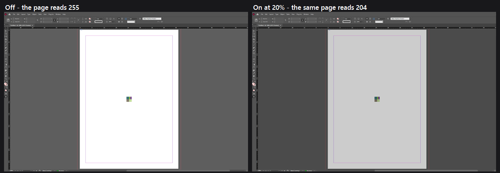

# Abode Night View

A display-only dimmer for Adobe document viewports for those late-night
crunching sessions.

*Please remember to turn it off when doing print preparation or color proofing.*

**Abode Night View** parks a black, click-through, layered window over each Adobe
document canvas and lets the Windows compositor multiply it down. The panels,
the menus, the toolbar, and everything else on your desktop are untouched.

**It never modifies a document.** It reads window geometry and paints its own
windows. It does not open, script, message, hook, or inject into any Adobe
application, and nothing it does can reach a saved file or an export.

  

The same InDesign document, a keystroke apart. The page goes from 255 to 204;
the toolbar, the panels, the rulers, the pasteboard, and the rest of the desktop
are pixel-identical. That is the whole product: the dimming is applied to the
document viewport and to nothing else. The ratio is measured, not asserted — the
numbers for all five products are in
[Compatibility](docs/compatibility.md#the-dimming-is-exact).

---

## Start it

    AbodeNightView.exe          start it; a certain fish appears in the tray
    tray → Enabled              on / off
    tray → Schedule             on and off by the clock, on a range you set

One file, 387 KB — no installer, no admin rights, no runtime to download.
Settings land beside the executable, so the folder is portable. It is unsigned,
so SmartScreen will warn on first run: *More info* → *Run anyway*.

**No keyboard shortcut is bound out of the box**, on purpose — a global hotkey is
taken from every program on the machine, not just from Adobe, and no combination
is free of AltGr, free inside Adobe, and present on every keyboard at once. Set
your own in tray → Shortcuts; the editor tells you what each one would cost you
on *your* keyboard. See [Shortcuts](docs/usage.md#shortcuts).

---

## What gets dimmed

One overlay per **visible document viewport** — not per application. Two
documents tiled side by side get two overlays; four applications get four; an
application with no document open gets none.

| product | what the overlay covers by default | rulers dimmed | on by default |
|---|---|---|---|
| InDesign | the canvas, inside the rulers and scrollbars | no | yes |
| Illustrator | the canvas: artboards *and* pasteboard | yes, if shown | yes |
| InCopy | the whole document viewport | yes, if shown | yes |
| Photoshop | the whole document viewport, image and pasteboard | yes, if shown | **no** |
| Acrobat | the page area, inside the scrollbar | n/a | yes |

You can change the region per product (tray → Region): **Canvas only**,
**Document viewport** (adds rulers and scrollbars), **Application client area**,
or **Whole window**.

Photoshop starts switched off deliberately, and the ruler column is a consequence
of how each application lays its windows out rather than a policy — both are
explained in [Design notes](docs/design-notes.md#why-photoshop-is-off-by-default)
and [Compatibility](docs/compatibility.md#rulers).

---

## Color-critical work

**Disable Abode Night View for color-critical visual judgment.**

It changes nothing in your document and nothing in an export. It does change what
you see: a neutral multiply of every pixel inside the viewport. Tone, contrast,
and apparent saturation are all affected. Switch it off — tray → Enabled, or a
shortcut of your own — before you judge a color, a proof, or a black point.

It is a comfort filter, not a color-management tool, and it does not pretend to
be one.

---

## Safety check

If you want to satisfy yourself before running it on a machine with unsaved work:

- **No injection.** `SetWinEventHook` is called with `WINEVENT_OUTOFCONTEXT` and
  a null module handle — the callback runs in *this* process. No DLL is loaded
  into any Adobe application.
- **No hooks into input.** `RegisterHotKey` only; no `WH_KEYBOARD_LL`, no
  `SetWindowsHookEx` of any kind, no synthetic input.
- **No persistence.** Nothing is written to the registry, no service, no
  scheduled task, no startup entry. The only file it creates is its own `.ini`
  and the reports you ask for.
- **No network.** There is no socket, no HTTP client, no telemetry.
- **No elevation.** No manifest requests it and nothing needs it.
- **No writes to Adobe.** It calls window *query* APIs and positions its own
  windows. It never sends a message to an Adobe window, never posts input to
  one, never scripts one, and never opens a document.

The whole Win32 surface is about 50 imports, all documented window, DPI, monitor,
and DWM functions. `--diagnostics` lists which of them this machine actually has.

You do not have to take any of that on trust either —
[`--verify`](docs/development.md#verifying-it-yourself) measures it.

---

## Compatibility

InDesign, Illustrator, InCopy, Photoshop, and Acrobat **2026 are tested and
measured** on Windows 11; the Windows floor is Windows 10 21H2. There is no
version whitelist anywhere in the source — a product is recognized by structure,
so a future Adobe release attaches normally if it still looks the same, and
`--probe` says exactly which step failed if it does not.

Full matrices, evidence levels, and known limitations:
[docs/compatibility.md](docs/compatibility.md).

---

## Documentation

| | |
|---|---|
| [Usage](docs/usage.md) | The tray menu, the schedule, shortcuts, settings, the command line, and what to send with a bug report |
| [Compatibility](docs/compatibility.md) | What was tested, on what, how sure — and the known limitations |
| [Design notes](docs/design-notes.md) | Why it is like this: the one filter, the modes that were removed, and the wording in the tray |
| [Internals](docs/internals.md) | The compositor math, the adapters, z-order, input, and tracking |
| [Development](docs/development.md) | Building, verifying it yourself, performance, and the repository layout |

Further reading: [FEASIBILITY.md](FEASIBILITY.md) is the engineering log — what
was tried and what it measured. [MACOS.md](MACOS.md) is a shelved macOS
feasibility study. [CHANGELOG.md](CHANGELOG.md) is the release history.

---

## License

**GNU General Public License, version 3 or later** (`GPL-3.0-or-later`). The full
text is in [LICENSE](LICENSE); every source file carries an SPDX header; the
About box shows the notice with the license linked, which is the form the GPL
itself asks for.

In short, and without replacing the text: you may use it, read it, change it, and
pass it on, and anything you pass on carries the same freedoms and the same
source. It comes with **no warranty**, which is not boilerplate here — this is a
utility that draws over other programs' windows, and the
[Safety check](#safety-check) above is what is offered instead of a promise.

Copyright © 2026 Vixen420.

Bugs and Adobe versions that will not attach:
[Issues](https://github.com/VulpesNexus/abode-night-view/issues) — attach the
output of `--diagnostics` and, if a product refused to attach, `--probe`.
