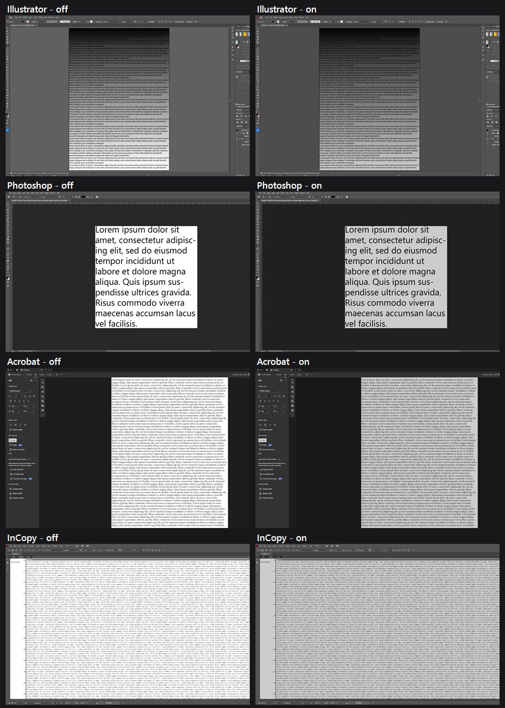

# Compatibility

What was tested, on what, how sure — and what is known not to work.

- [The dimming is exact](#the-dimming-is-exact)
- [Evidence levels](#evidence-levels)
- [Adobe products](#adobe-products)
- [Displays](#displays)
- [Operating systems](#operating-systems)
- [Future Adobe versions](#future-adobe-versions)
- [Rulers](#rulers)
- [What the Illustrator overlay covers](#what-the-illustrator-overlay-covers)
- [Known limitations](#known-limitations)

---

## The dimming is exact

204 is not an approximation. The Strength window in the
[front-page screenshot](../README.md) reads `20% (k = 0.80)` and
`255 (pure white) now displays as 204.`, and sampling the page in both images
gives 254.8 and 204.2 — a measured ratio of 0.802 against a stated 0.800. The
same measurement across all five products gives 0.802, 0.809, and 0.803 for
InDesign, Acrobat, and InCopy; Illustrator reads lower only because the two
captures are not scrolled to the same pixel.

  

---

## Evidence levels

Four evidence levels, used strictly:

- **Tested** — run here, measured, numbers recorded in this repository.
- **Structurally expected** — the code path is version-independent and the
  structure it needs is documented, but this exact version has not been run.
- **Experimental** — implemented but not trusted.
- **Unsupported** — will not attach.

"Supported" here means *tested and measured*, not "I see no reason it wouldn't
work". The two are kept apart everywhere in this documentation.

---

## Adobe products

Every ratio below is `canvas luminance with the overlay on ÷ canvas luminance
with it off`, at strength 55, where the alpha implies **k = 0.451**. All five
were measured in one session against `dist\AbodeNightView.exe` 1.2.0, with all
five overlays live at the same time.

| product | version tested | status | evidence |
|---|---|---|---|
| InDesign | 2026 (21.5.1) | Supported | **Tested** — verify 13/13, canvas 183.71 → 82.87, ratio **0.451** |
| Illustrator | 2026 (30.7.0) | Supported | **Tested** — verify 13/13, canvas 118.14 → 53.06, ratio **0.449** |
| InCopy | 2026 (21.5.1) | Supported | **Tested** — verify 12/12, canvas 147.15 → 66.13, ratio **0.449**. Promoted from "structurally expected" only after a document was open and the viewport actually validated |
| Photoshop | 2026 (27.9) | Supported, **off by default** | **Tested** — verify 13/13, canvas 141.02 → 63.53, ratio **0.450**. See [why the default is off](design-notes.md#why-photoshop-is-off-by-default) |
| Acrobat | 26.1.21771.0 | Supported | **Tested** — verify 14/14, canvas 207.02 → 93.98, ratio **0.454** |
| InDesign / Illustrator / Photoshop / InCopy / Acrobat, other years | — | Expected | **Structurally expected** — there is no version whitelist; see [Future Adobe versions](#future-adobe-versions). Partly demonstrated: Illustrator **28.7.10** (2024, two majors older than the version above) resolved its viewport unchanged and the overlay landed exactly on the canvas rectangle — 7 structural checks, 0 failures. The photometric half was not taken, because Adobe's own "an older version is installed" dialog was sitting over the canvas and the verifier refuses to measure through an obstruction |
| After Effects, Premiere Pro, Media Encoder | — | Unsupported | Deliberate. The viewport is video, usually dark, and color-critical. Dimming it is the wrong tool |
| Audition | — | Unsupported | No page-like viewport |
| Bridge | — | Unsupported | A thumbnail grid on a dark ground; nothing white to dim |
| Lightroom Classic, Animate, Dreamweaver, XD | — | Not investigated | Not installed on the machine this was built on. Saying anything about them would be guessing |

---

## Displays

| configuration | status |
|---|---|
| 1920×1080, 2560×1440, 1440×2560 portrait, 1280×720 | **Tested** — 17/17 rectangles exact |
| three monitors, negative desktop coordinates, monitor-edge straddling | **Tested** |
| 100 % scaling | **Tested** — every measurement in this documentation |
| **125 % scaling** | **Tested by hand** — run by the user on their own machine; no visible defects. This is a human looking at the screen, not an automated measurement, and it is recorded as such |
| other scaling factors, mixed-DPI setups, 4K, HDR, Remote Desktop | Not tested. The code holds no logical-pixel constants; see [Known limitations](#known-limitations) |

---

## Operating systems

| platform | status | backend |
|---|---|---|
| Windows 11 (26200) | **Tested** | Win32 + DWM layered composition |
| Windows 11, other builds | Structurally expected | same |
| Windows 10 22H2 (19045) / 21H2 (19044) | Structurally expected | same |
| Windows 10 before 2004 (19041) | Degraded | everything works except screen-capture exclusion, which is version-gated and reported |
| Windows 8.1 and older | Unsupported | not claimed, not tested; Adobe does not support its 2026 applications there either |
| macOS | **Shelved** | Research only. No implementation, no build, no support claim, until there is Apple hardware to test on — see [MACOS.md](../MACOS.md) |

**The Windows floor is Windows 10 version 21H2 (build 19044)**, chosen because
that is the oldest Windows on which Adobe supports the applications this
attaches to. Every API used is present from there on, including
`WDA_EXCLUDEFROMCAPTURE` (needs 19041). The DPI, monitor, and cloaking APIs are
all reached through a fallback cascade, so an older Windows degrades rather than
crashes — but that is a property of the code, not a tested claim.

---

## Future Adobe versions

There is no version table anywhere in the source. A product is recognized by
**process name plus frame window class**, and then the structure is *validated*:

    Illustrator.exe running
      -> a top-level window of class 'illustrator'
      -> ... > OWL.TabGroup > OWL.Document > inner view container
      -> attach

An Adobe release from a year that did not exist when this was built attaches
normally if it still looks like that, and appears in the tray menu under its own
name — which is read from the executable's `ProductName` resource, so it says
"Adobe Illustrator 2028" without anybody having typed that.

If the structure has changed, nothing is dimmed and `--probe` says exactly which
step failed and what it found instead. That is the difference between a version
whitelist and capability detection: the failure is diagnosable without a rebuild.

---

## Rulers

InDesign's rulers are **not dimmed**. Illustrator's and Photoshop's **are**, if
you have them switched on. That is not a policy; it is a difference in how the
two lay their windows out, and it decides the matter on its own.

InDesign's canvas is a real child window that is inset from the document
container by exactly the strips Adobe paints the rulers and scrollbars into:

    OWL.Document        43,132  2094x1259
      canvas child      59,148  2063x1227      <- inset 16 left, 16 top
                                                  (rulers), 15 right, 16 bottom
                                                  (scrollbars)

Dimming the canvas therefore leaves them alone for free, measured at ratio
**1.000** on all four strips. It also follows View → Show/Hide Rulers with no
code involved: hide them and the same child window grows to `43,132 2079x1243`,
reclaiming the strip, and the overlay follows on the next tick.

Illustrator and Photoshop put their canvas child at the *same origin* as the
document container — `42,100 1893x1250` inside `42,100 1909x1291` — and paint
the rulers inside it. There is no ruler window to measure and nothing in the
geometry that distinguishes a ruler from the artwork under it. Measured on
Illustrator at strength 35: the rulers dim to **0.657**, the canvas to 0.646.

Excluding them would mean a hard-coded strip thickness. That fails for the same
reason a hard-coded anything fails here: Adobe scales the ruler with its own **UI
Scaling** preference, which is independent of the Windows DPI, so a constant that
is right on this machine is wrong on the next one — and being wrong means either
an undimmed band inside the canvas or a dimmed band across the artwork. Left as a
known cosmetic limitation rather than guessed at.

The `--verify` run asserts this: every strip the canvas rectangle excludes is
photographed with the overlay off and on and must not have been multiplied by k.
Full numbers in [`measurements/rulers.md`](../measurements/rulers.md).

---

## What the Illustrator overlay covers

The overlay covers the whole document viewport, so it dims the artboards, the
pasteboard *and the artwork on them*. It does not replace white artboards with
dark ones and it is not a UI theme: it is an optical filter over everything in
that rectangle. In practice that is what you want — the glare is the artboard —
but artwork inside the artboard is dimmed by exactly the same factor.

---

## Known limitations

**A dialog an application raises while it is in the background looks dimmed.**
Windows will not let a non-foreground process take the top of the z-order —
explicitly raising it does not help either; that was measured. Clicking the
dialog fixes it instantly, and the overlay is click-through so the dialog is
fully usable meanwhile. Not fixed, because the fix is the adjacency rule already
measured as a flicker cause.

**Illustrator, Photoshop, and InCopy dim their rulers along with the canvas.**
Their canvas child window starts at the document origin and the rulers are
painted inside it, so there is no rectangle to exclude — see
[Rulers](#rulers) for the measurements and for why a fixed inset was rejected.
InDesign is unaffected: its rulers sit outside the canvas window and stay at full
brightness.

**Display scaling: 100 % is measured, 125 % has been checked by eye, the rest is
untested.** All three monitors on the development machine are 96 DPI, so every
number in this documentation is a 100 % number; 125 % was run by hand on the
user's own machine with no visible defects, which is a person looking at a screen
rather than a measurement. Nothing above that, and no mixed-DPI configuration,
has been tried. What *is* established mechanically: there is not one hard-coded
pixel coordinate in the source, every rectangle is a physical-pixel
`GetWindowRect` fed straight to `SetWindowPos`, and the process is made
PerMonitorV2-aware before any window exists.

**Global shortcuts beat the application's own** — which is why none is bound
out of the box. `RegisterHotKey` is a system-wide grab dispatched before the
focused application sees the key, so anything you bind is taken from every
program on the machine. Collisions with another application are detected and
reported rather than silently swallowed, and the editor warns before you take a
key your own keyboard layout needs. See
[Shortcuts](usage.md#shortcuts).

**The schedule is edge triggered, and that is deliberate.** Switching the
dimming off by hand inside a scheduled period keeps it off until the range next
begins or ends, rather than for a quarter of a second. The cost is that "put it
back the way the schedule wants it, now" is not a thing you can ask for; the
answer is to wait for the boundary, or to switch it by hand.

**Product toggles apply to every instance** of that product. Two InDesign windows
are either both dimmed or both not. `--pid=` restricts the whole utility to one
process if you need that.

**Acrobat's floating page toolbar** is an owned window that sits over the page.
It is re-seated above the overlay on activation, so it is undimmed while you are
working in Acrobat. If you have not clicked into Acrobat since it appeared, it
may be dimmed with the page.
